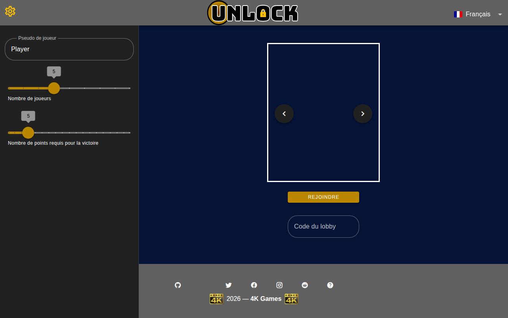
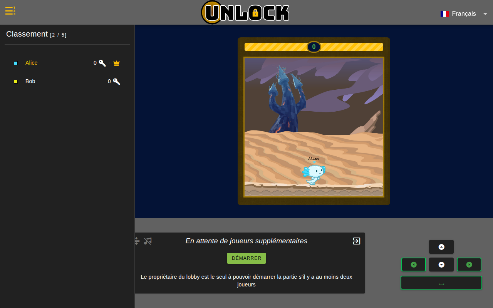
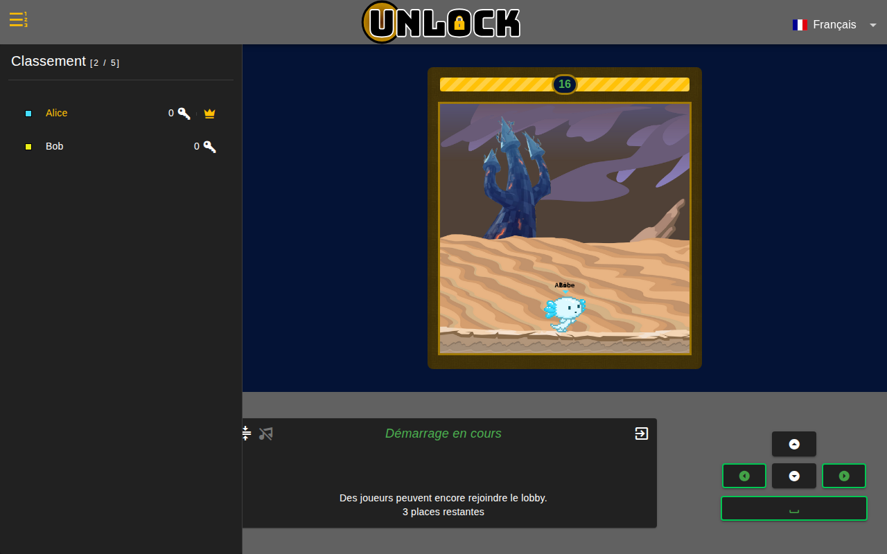
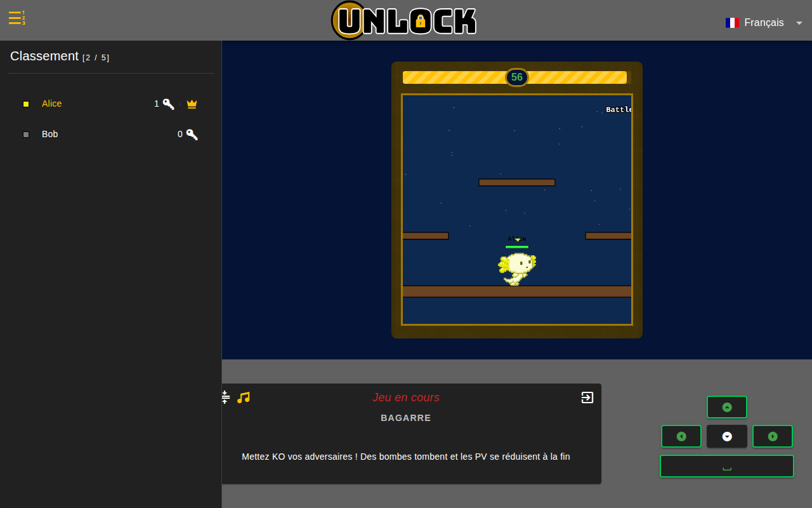
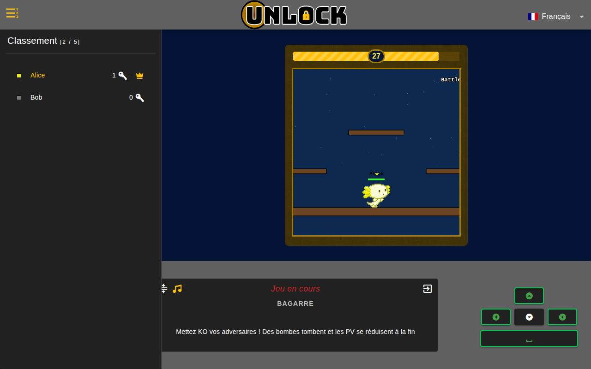
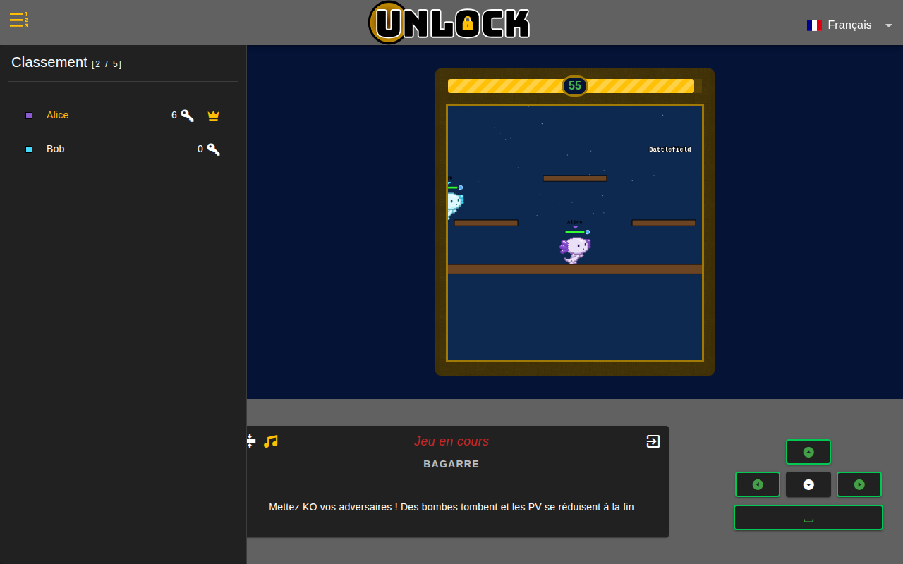
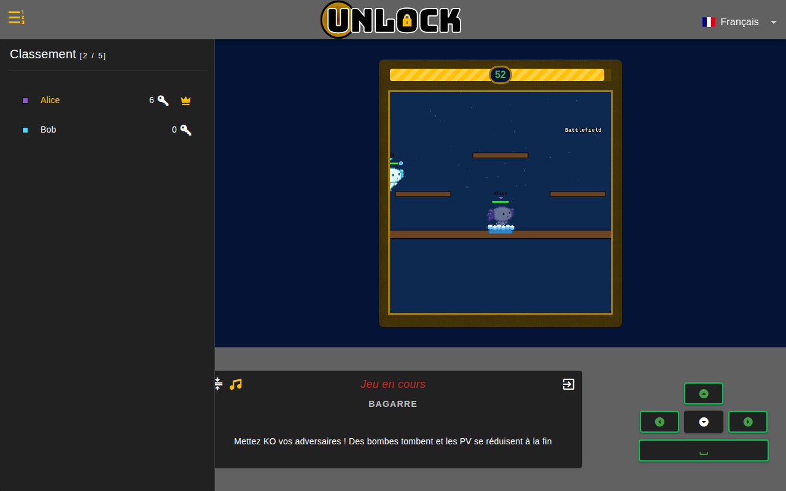
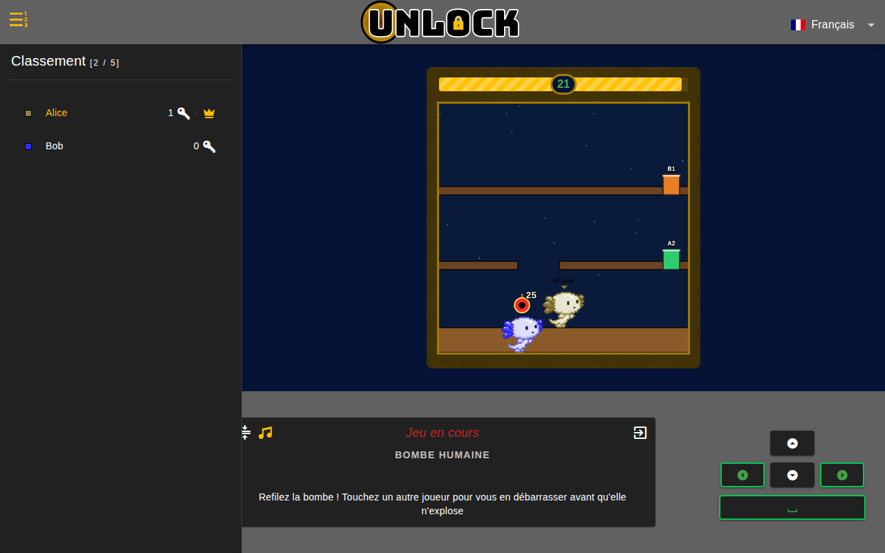
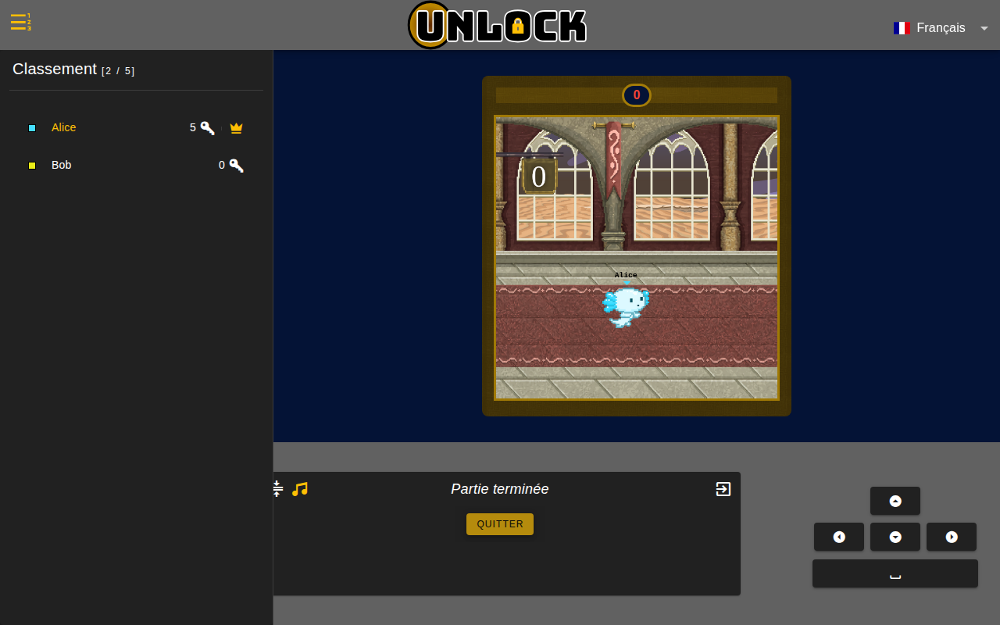
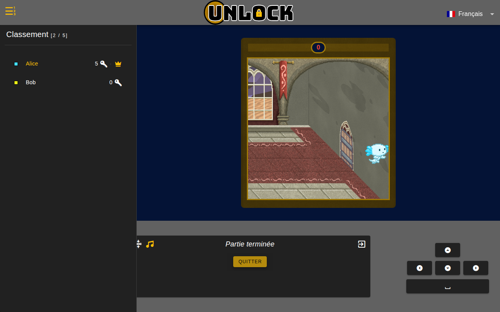

# Unlock

> Jeu multijoueur en temps réel inspiré du party game. Jusqu'à 10 joueurs
> s'affrontent dans une suite de **six mini-jeux** ; le premier qui atteint
> le nombre de clés requis (`pointsGoal`) gagne la partie et s'échappe du donjon.



## Sommaire

- [Concept](#concept)
- [Les mini-jeux](#les-mini-jeux)
  - [Bagarre (Brawl)](#bagarre-brawl)
  - [Chute de pommes (Falling Apples)](#chute-de-pommes-falling-apples)
  - [Îles flottantes (Floating Islands)](#îles-flottantes-floating-islands)
  - [Bombe humaine (Hot Potato)](#bombe-humaine-hot-potato)
  - [Légumes de l'espace (Space Vegetables)](#légumes-de-lespace-space-vegetables)
  - [Guerre des étoiles (Star Wars)](#guerre-des-étoiles-star-wars)
- [Déroulement d'une partie](#déroulement-dune-partie)
- [Lancer le jeu en local](#lancer-le-jeu-en-local)
- [Architecture](#architecture)
- [Redéploiement cloud](#redéploiement-cloud)
- [Pour aller plus loin](#pour-aller-plus-loin)

## Concept

Chaque joueur incarne un **axolotl** prisonnier dans un donjon. Pour
s'échapper, il faut décrocher des **clés** en gagnant des mini-jeux. Le
premier à atteindre le `pointsGoal` (configurable, 2–20) ouvre la porte de
sortie et remporte la partie.

Un **lobby** correspond à une partie : un code partagé entre joueurs, un
hôte (le créateur), une capacité (2–10), et un objectif de points. La
synchronisation se fait via Firestore (état du lobby) et WebSocket (gameplay
temps réel).

### Lobby — salle d'attente

Quand un joueur ouvre un code de lobby, il rejoint la salle d'attente. Le
**propriétaire** (couronne dorée dans le classement) est le seul à pouvoir
démarrer la partie, à condition qu'il y ait au moins deux joueurs.



Une fois le bouton **DÉMARRER** cliqué, un compte à rebours s'enclenche.
Pendant les 8 premières secondes, d'autres joueurs peuvent encore rejoindre.
Ensuite le lobby se verrouille (**Démarrage imminent**) et la cage descend
sur les axolotls.



## Les mini-jeux

Chaque mini-jeu dure entre 25 et 60 secondes selon le concept. Le serveur
tire le suivant au hasard parmi les six disponibles, en évitant de
relancer deux fois de suite le même.

### Bagarre (Brawl)



> **Objectif** : être le dernier debout en mettant KO vos adversaires
> à coups de poing.

Combat **free-for-all entre 2 ou 3 participants** tirés au sort (3 si
le lobby a un nombre impair de joueurs, 2 sinon) sur l'un de **3 terrains
style Smash Bros** : Battlefield, Final Destination ou Stairs. Les autres
joueurs sont spectateurs pour cette manche.

Chaque participant commence avec **5 PV**. Un coup de poing inflige
**1 PV de dégât**, une bombe en inflige **2**.

Deux mécaniques de pression au fil du temps :

- **À partir de 30 s** : des **bombes tombent du ciel** à intervalles
  aléatoires sur la zone de combat.
- **À partir de 45 s** (15 s restants) : le **plafond de PV décroît
  linéairement** de 5 à 1, forçant les survivants à terminer le combat —
  dans les dernières secondes, **un coup de poing élimine**.



**Égalité** : si à la fin des 60 s il n'y a pas exactement un seul
survivant, **personne ne gagne de point** (égalité parfaite).

- **Contrôles** :
  - ← → : déplacement
  - Espace ou ↑ : saut
  - **Clic droit** (ou F) : coup de poing — halo rouge + texte "POW!"
    en jaune. Touche les adversaires dans une hitbox 80 × 60 px dans
    la direction face. Cooldown 500 ms.
  - **Clic gauche** (ou E / Shift) : **esquive surf** — l'axolotl
    devient translucide pendant 500 ms en surfant sur une vague d'eau,
    immunisé aux coups de poing et aux bombes. Cooldown 8 s.
- **Indicateurs** : les barres de vie au-dessus de chaque axolotl
  indiquent les PV (vert / jaune / rouge) avec un repère orange pour le
  HpCap courant. À droite de chaque barre, un petit cercle bleu
  indique l'état du cooldown d'esquive (plein = prêt, arc qui se remplit
  = en cooldown).
- **Caméra** : dézoom 25 % pour avoir une vue large du terrain.
- **Condition de victoire** : `Timeout` — dernier debout, sinon aucun
  vainqueur.





### Chute de pommes (Falling Apples)

### Chute de pommes (Falling Apples)


> **Objectif** : récolter 7 pommes avant les autres joueurs.

Des pommes tombent en cascade depuis le sommet de la forêt. Chaque joueur
contrôle son axolotl avec un **panier sur la tête** et doit se déplacer
pour les attraper. Premier à 7 pommes gagne la manche.

- **Contrôles** : flèches gauche / droite (ou A / D) pour se déplacer.
- **Condition de victoire** : `First` (premier à atteindre le quota).

### Îles flottantes (Floating Islands)


> **Objectif** : rester en vie en sautant entre les îles flottantes.

Les axolotls tombent dans un ciel rempli d'îles éparpillées sur plusieurs
étages. Chaque île survit quelques centaines de millisecondes au passage
d'un joueur avant de **s'effondrer** : il faut sans cesse sauter d'île
en île. Le dernier survivant gagne la manche.

- **Contrôles** : ← → (déplacement), Espace (saut). Les petites îles
  s'effondrent plus vite (250 ms) que les grandes (500 ms).
- **Condition de victoire** : `Timeout` — dernier joueur en vie. Si le
  joueur **change d'onglet pendant la partie**, son axolotl tombe
  automatiquement (le serveur surveille le focus via le packet
  `CLIENT_FOCUS`).

### Bombe humaine (Hot Potato)



> **Objectif** : refilez la bombe à un autre joueur avant qu'elle n'explose.

Au départ de la manche, **un joueur tiré au sort** se voit affublé d'une
bombe au-dessus de la tête (cercle rouge avec une mèche allumée). Le
porteur a 25 secondes pour s'en débarrasser en **touchant un autre
joueur** : la bombe change instantanément de mains (cooldown 1 s pour
éviter le ping-pong). À l'expiration du chrono, le porteur final
explose : **tous les autres joueurs gagnent la manche**.

Le terrain est un **arène à 4 niveaux** (sol + 2 plateformes
intermédiaires + plateforme du haut) avec deux paires de **tuyaux qui
téléportent** entre étages (paire verte A1↔A2, paire orange B1↔B2). De
quoi feinter l'adversaire et créer des poursuites verticales.

- **Contrôles** : ← → (déplacement), Espace (saut), contact avec un
  tuyau pour téléporter.
- **Condition de victoire** : `Timeout` — tout le monde sauf le porteur
  final gagne (`WinnersNumber` dynamique = nbJoueurs − 1).

### Légumes de l'espace (Space Vegetables)


> **Objectif** : tirer pour éliminer le légume central.

Les joueurs pilotent un **vaisseau spatial** en bas de l'écran. Au centre,
une couronne de petits légumes en orbite protège un gros légume au cœur. Il
faut canarder les petits jusqu'à atteindre le boss.

- **Contrôles** : flèches gauche / droite pour orbiter, clic gauche pour
  tirer un laser.
- **Condition de victoire** : `Timeout` — quand le temps s'écoule, c'est
  celui qui a porté le coup final qui gagne (sinon match nul).

### Guerre des étoiles (Star Wars)


> **Objectif** : récolter 6 étoiles avant les autres joueurs.

Les vaisseaux spatiaux se déplacent dans toutes les directions dans l'espace.
Des étoiles apparaissent aléatoirement ; il suffit de passer dessus pour
les ramasser. Premier à 6 étoiles gagne la manche.

- **Contrôles** : flèches directionnelles (haut/bas/gauche/droite) ou
  ZQSD / WASD selon le clavier.
- **Condition de victoire** : `First` (premier à 6 étoiles).

## Déroulement d'une partie

1. **Lobby en attente** : les joueurs rejoignent via le code, l'hôte
   ajuste la capacité et le `pointsGoal`.
2. **Démarrage** : compte à rebours de 20 s, dont 8 s avant le verrouillage
   du lobby.
3. **Préparation** : 15 s entre chaque mini-jeu, durant lesquels les
   joueurs sont placés dans une salle d'attente (ou trébuchent dans une
   trappe s'ils ont perdu le mini-jeu précédent).
4. **Mini-jeu** : environ 30 s de jeu, suivi du **reward** des gagnants
   (1 clé chacun par défaut).
5. **Boucle** jusqu'à ce qu'un joueur atteigne le `pointsGoal`.
6. **Fin de partie** : l'EndScene se charge, le gagnant marche dans le
   couloir du donjon vers la porte de sortie. Bouton **QUITTER** disponible.





## Lancer le jeu en local

### Prérequis

| Outil           | Version | Pourquoi                              |
| --------------- | ------- | ------------------------------------- |
| Node            | ≥ 20    | Build Vite, exécution des scripts JS  |
| Go              | ≥ 1.21  | Compilation du serveur WebSocket      |
| Java            | ≥ 17    | Émulateur Firestore (process JVM)     |
| firebase-tools  | latest  | Lancement de l'émulateur, déploiement |

```bash
npm install -g firebase-tools
```

### Tout démarrer d'un coup

```bash
./dev.sh                # émulateur Firestore + serveur Go + Vite
./dev.sh --no-client    # idem, sans Vite (utile pour les tests serveur)
```

Le script consolide les logs dans `.dev/logs/{firestore,server,client}.log`
et nettoie tout proprement à `Ctrl+C`.

| URL                              | Service                          |
| -------------------------------- | -------------------------------- |
| <http://127.0.0.1:3000>          | Client Vite (le jeu)             |
| `ws://127.0.0.1:8080`            | Serveur WebSocket                |
| <http://127.0.0.1:4000>          | UI émulateur Firebase            |
| `127.0.0.1:8181`                 | Émulateur Firestore (REST + gRPC) |

### Démarrage manuel

```bash
# Terminal 1 : émulateur Firestore
firebase emulators:start --only firestore --project=unlock-local

# Terminal 2 : seed les configs de mini-jeux dans l'émulateur
FIRESTORE_EMULATOR_HOST=127.0.0.1:8181 GCP_PROJECT_ID=unlock-local \
  node scripts/seed-firestore.mjs

# Terminal 3 : serveur Go
cd server
PORT=8080 \
GCP_PROJECT_ID=unlock-local \
FIRESTORE_EMULATOR_HOST=127.0.0.1:8181 \
ALLOWED_ORIGINS=http://localhost:3000,http://127.0.0.1:3000 \
go run .

# Terminal 4 : client Vite
cd client
cp .env.local.example .env.local
npm install
npm run dev
```

### Jouer à deux sur la même machine

Ouvre `http://127.0.0.1:3000` dans **deux onglets différents** (de
préférence en navigation privée pour avoir des sessions WebSocket distinctes),
choisis un même code de lobby et rejoins. Le second joueur entre dans la
salle d'attente du premier ; l'hôte voit alors le bouton DÉMARRER s'activer.

### Outils de debug en dev

- `window.$store` est exposé sur la console : `window.$store.state.lobby`,
  `window.$store.dispatch('sendPacket', {...})`.
- L'UI de l'émulateur Firestore (`:4000`) montre les documents `/lobbies`
  et `/games` en temps réel.
- `scripts/seed-firestore.mjs` peut être relancé à tout moment pour
  remettre les configs `games/*` à plat.

## Architecture

```
unlock/
├── client/                # SPA Vue 3 + Vuetify 3 + Phaser 3 (build Vite)
│   ├── src/
│   │   ├── components/    # UI : Display, Ladder, Settings, Keyboard, Mouse...
│   │   ├── views/         # Home, About, Lobby
│   │   ├── models/        # Modèles JS (Client, Lobby, Game), packets, scènes Phaser
│   │   ├── services/      # firebase, router, i18n, store (façade Pinia)
│   │   ├── stores/        # Pinia
│   │   └── plugins/       # vuetify
│   └── package.json
├── server/                # Serveur WebSocket Go 1.23
│   ├── main.go            # HTTP + upgrade WS + CORS env-driven
│   ├── models/            # Lobby, Client, Game, packets (contrat avec le client)
│   ├── constants/         # Enums, timeouts, sprite colors
│   ├── firestore/         # Helpers Firestore admin (lazy singleton client)
│   ├── Dockerfile         # Multi-stage → distroless static non-root
│   └── service.yaml       # Manifest Knative Cloud Run paramétrable
├── scripts/
│   └── seed-firestore.mjs # Seed des configs games/* en dev local
├── docs/
│   └── screenshots/       # Captures utilisées dans la doc
├── firestore.rules        # Lecture publique des lobbies, écriture serveur uniquement
├── firestore.indexes.json
├── firebase.json          # Hosting + Firestore + config émulateurs
├── .firebaserc            # Projet GCP par défaut
├── dev.sh                 # Démarre la stack locale en une commande
├── deploy.sh              # Redéploie toute la stack cloud, étape par étape
└── .env.example           # Variables consommées par deploy.sh
```

### Stack

| Couche      | Technologie                                              | Hébergement                |
| ----------- | -------------------------------------------------------- | -------------------------- |
| Client      | Vue 3.5, Vuetify 3, Pinia, VueFire, vue-i18n 11, Phaser 3 | Firebase Hosting           |
| Build       | Vite 6, ESLint 9                                         | —                          |
| Serveur     | Go 1.23, gorilla/websocket, Firestore admin SDK         | Cloud Run (Artifact Registry) |
| Base        | Firestore (mode natif)                                   | GCP                        |

### Communication client ↔ serveur

Le contrat est défini par les **packets** symétriques entre
`server/models/packet_*.go` et `client/src/models/packets/packet-*.js`.
Les `label` côté JSON sont la source de vérité. Une rupture de contrat
entre les deux côtés casse le jeu silencieusement → toute modification
doit être faite des deux côtés simultanément.

- **CLIENT_* → serveur** : `CLIENT_CONNECTION`, `CLIENT_FOCUS`,
  `CLIENT_LOBBY_START`, `CLIENT_SCENE_BRAWL_BOMB_HIT`,
  `CLIENT_SCENE_BRAWL_DODGE`, `CLIENT_SCENE_BRAWL_PUNCH`,
  `CLIENT_SCENE_FLOATING_ISLANDS_COLLIDE`,
  `CLIENT_SCENE_FLOATING_ISLANDS_FALL`, `CLIENT_SCENE_HOT_POTATO_TAG`,
  `CLIENT_SCENE_MOVEMENT`, `CLIENT_SCENE_STAR_WARS_COLLECT`, `CLIENT_WIN`.
- **SERVER_* → clients** : `SERVER_CONNECTION`, `SERVER_COUNTDOWN`,
  `SERVER_GAME_START`, `SERVER_GAME_WAIT`, `SERVER_LOBBY_COLLAPSE`,
  `SERVER_LOBBY_END`, `SERVER_LOBBY_INTERRUPT`, `SERVER_SCENE_DATA`,
  `SERVER_SCENE_MOVEMENT`.

## Redéploiement cloud

```bash
cp .env.example .env
# éditer .env : PROJECT_ID, REGION, ALLOWED_ORIGINS, config Firebase client...
./deploy.sh
```

Le script enchaîne, de façon idempotente :

1. Vérification des prérequis (`gcloud`, `firebase`, `node`, `go`, `docker`).
2. Activation des APIs GCP (Cloud Run, Artifact Registry, Firestore,
   Firebase, Cloud Build).
3. Création du dépôt Artifact Registry si absent.
4. Création de la base Firestore si absente.
5. Déploiement des règles + indexes Firestore.
6. Build & push de l'image serveur dans Artifact Registry.
7. Déploiement Cloud Run (session-affinity activée pour le WebSocket).
8. Récupération de l'URL Cloud Run et écriture de
   `client/.env.production`.
9. Build du client (`npm ci && npm run build`).
10. Déploiement Firebase Hosting.

Options utiles :

| Flag             | Effet                                                   |
| ---------------- | ------------------------------------------------------- |
| `--skip-server`  | Ne redéploie que le client + l'infra                    |
| `--skip-client`  | Ne redéploie que le serveur + l'infra                   |
| `--skip-infra`   | Saute APIs, Artifact Registry, Firestore et rules       |
| `--dry-run`      | Affiche les commandes sans les exécuter                 |
| `--tag <sha>`    | Force le tag d'image (défaut : court SHA git)           |

> **Note prod** : les images des aperçus de la roulette (page d'accueil)
> sont hébergées dans Firebase Storage du projet existant
> (`unlock-db.appspot.com`), pas dans le repo. Pour un nouveau déploiement
> il faut recréer le bucket et y uploader `game_falling_apples.png` et
> `game_space_vegetables.png`.

## Pour aller plus loin

- **Wiki** : voir `docs/wiki/` (pages prêtes à coller dans le wiki GitHub).
- **Variables d'environnement** : chaque niveau du repo a un
  `*.env.example` documenté. Les fallbacks par défaut pointent sur le
  projet existant `unlock-db`.
- **Tests** : pas de suite automatisée encore. Le scénario `dev.sh` +
  `scripts/seed-firestore.mjs` + 2 navigateurs permet de tester
  manuellement de bout en bout.
