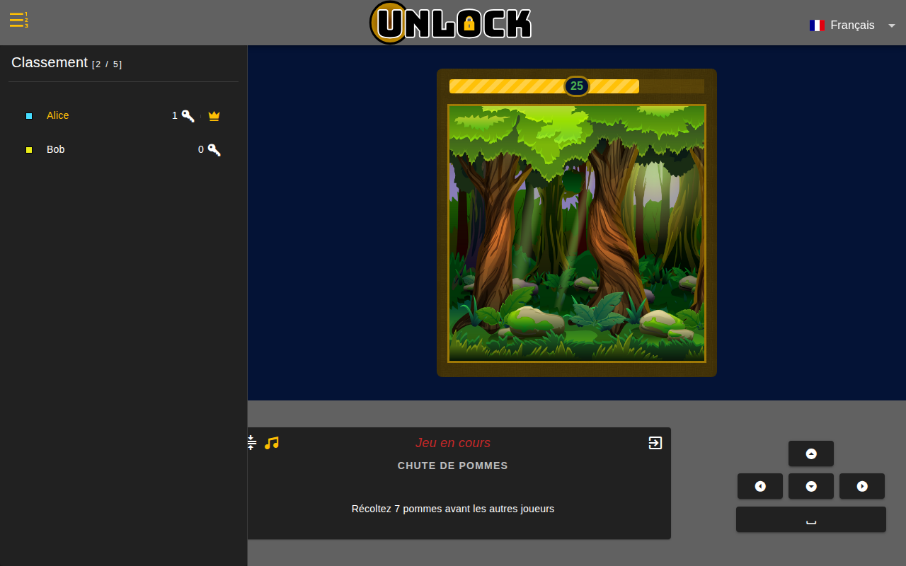
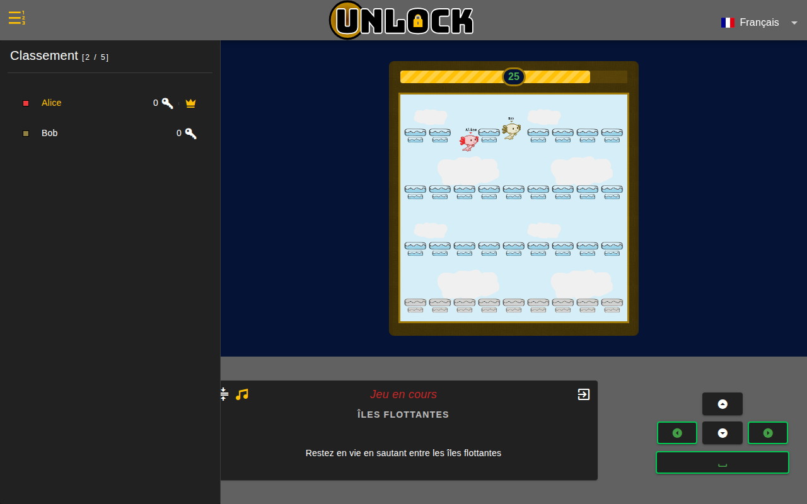
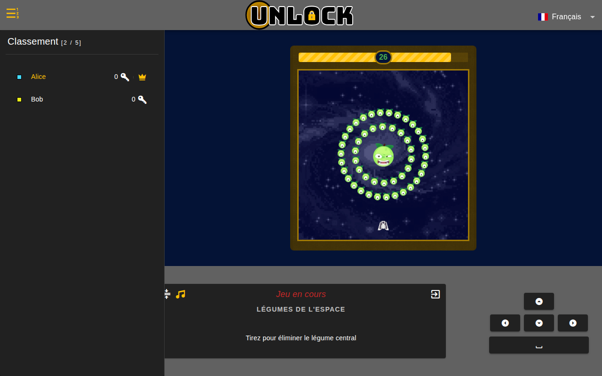
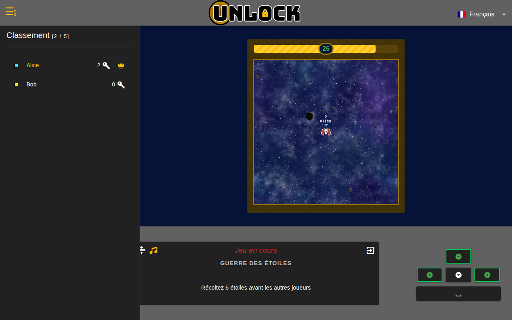

# Mini-jeux

Quatre mini-jeux sont disponibles. Le serveur tire le suivant au hasard,
en évitant de relancer immédiatement le même que la manche précédente.

Chaque manche dure environ **30 secondes** (`duration` dans
`/games/{SceneKey}` côté Firestore). Le gagnant reçoit **1 clé**
(`winReward`).

## Chute de pommes (`GameFallingApples`)



> Récoltez 7 pommes avant les autres joueurs.

### Règles

Des pommes tombent depuis le sommet de la forêt à intervalles réguliers.
Chaque joueur porte un **panier** sur la tête et doit se déplacer
latéralement pour attraper les pommes.

- **Win condition** : `First` — premier à 7 pommes remporte la manche.
- **Contrôles** : ← → (ou A / D).

### Côté serveur

- Game type : Solo
- WinnersNumber : 1
- WinReward : 1 clé

## Îles flottantes (`GameFloatingIslands`)



> Restez en vie en sautant entre les îles flottantes.

### Règles

Les axolotls sont propulsés au sommet d'un ciel rempli d'îles disposées
sur plusieurs étages (4 à 7 selon le nombre de joueurs). Chaque île
**s'effondre** quelques centaines de millisecondes après qu'un joueur
s'y pose : 250 ms pour les petites, 500 ms pour les grandes. Le dernier
survivant remporte la manche.

- **Win condition** : `Timeout` — dernier joueur en vie.
- **Contrôles** : ← → (déplacement), Espace (saut). Vitesse 1,5× celle
  des autres mini-jeux (`speedFactor` sur l'axolotl).
- Quand un joueur sort des limites du monde par le bas, le packet
  `CLIENT_SCENE_FLOATING_ISLANDS_FALL` est envoyé et il est éliminé.

### Anti-triche : surveillance du focus

Ce mini-jeu surveille la **visibilité de l'onglet** : si un joueur change
d'onglet (Alt-Tab, etc.) pendant la partie, son client émet un packet
`CLIENT_FOCUS` avec `state: false`, et le serveur déclenche
automatiquement un `CLIENT_SCENE_FLOATING_ISLANDS_FALL` pour l'éliminer
(cf. `server/models/game.go:HandleRequiredFocus`).

### Côté serveur

- Game type : Solo
- WinnersNumber : 1
- WinReward : 1 clé
- Duration : 30 000 ms

État serveur dans `server/models/data_scene_floating_islands.go` :
- Une map d'`Island` avec leur état (`Safe`, `Updating`, détruite)
- `RemainingPlayers` / `Losers` (set de UUIDs)
- `RemainingPlayersCount` (pour détecter le dernier survivant)

## Légumes de l'espace (`GameSpaceVegetables`)



> Tirez pour éliminer le légume central.

### Règles

Les joueurs pilotent un **vaisseau** en bas de l'écran. Au centre, un gros
légume est protégé par deux couronnes de petits légumes en orbite. Il
faut tirer pour briser ces couronnes puis viser le boss.

- **Win condition** : `Timeout` — quand le temps s'écoule, le gagnant est
  celui qui a porté le coup final au boss (si quelqu'un l'a abattu).
- **Contrôles** : ← → (déplacement), clic gauche (tir).

### Côté serveur

- Game type : Solo
- WinnersNumber : 1
- WinReward : 1 clé

## Guerre des étoiles (`GameStarWars`)



> Récoltez 6 étoiles avant les autres joueurs.

### Règles

Les vaisseaux se déplacent dans toutes les directions dans l'espace. Des
étoiles spawnent aléatoirement (max 6 à la fois, séparées d'au moins 100
pixels). Il suffit de passer dessus pour les ramasser.

- **Win condition** : `First` — premier à 6 étoiles gagne (cf.
  `server/models/packet_client_scene_star_wars_collect.go` :
  `if data.Points[client.Uuid] > 5`).
- **Contrôles** : ↑ ↓ ← → (ou ZQSD / WASD).

### Côté serveur

- Game type : Solo
- WinnersNumber : 1
- WinReward : 1 clé

## Configuration des mini-jeux

Les paramètres ci-dessus sont stockés dans la collection Firestore
`/games/{SceneKey}`. En production ils existent dans le projet GCP. En
dev local, ils sont seedés par `scripts/seed-firestore.mjs` (appelé
automatiquement par `dev.sh`).

```bash
FIRESTORE_EMULATOR_HOST=127.0.0.1:8181 GCP_PROJECT_ID=unlock-local \
  node scripts/seed-firestore.mjs
```

Le code de chaque scène est dans `client/src/models/scenes/` :

- `game-falling-apples-scene.js`
- `game-floating-islands-scene.js`
- `game-space-vegetables-scene.js`
- `game-star-wars-scene.js`

Logique métier serveur :
- `server/models/data_scene_star_wars.go` — StarWars (positions des étoiles)
- `server/models/data_scene_floating_islands.go` — Floating Islands
  (îles, joueurs restants, étages, focus)

Les deux autres mini-jeux (FallingApples, SpaceVegetables) sont gérés
côté client avec validation par `CLIENT_WIN`.
